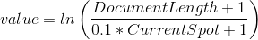

### How it works
---
Traditionally the TF-IDF method of encoding scores at the document level in the TF portion, which stands for Term Frequency.  This is done with either a raw count, a precentage count, or some other variation on the count.

The current implementation scores the words based on a logrithmic scale by where it appears within a docuemnt.  This is done with the formula:

Do note that the CurrentSpot counter starts from 0.  Also this formula has a similar structure to the IDF portion of the TF-IDF calculation.

---
An example of the difference
---

To illustrate how its different, consider the simple sample document:

"Dog eat tasty dog food"

---
The Term frequency count method (TF) would score this document by first counting the occurances of the word:

(with raw count)

| dog | eat | tasty | dog | food |
| --- | --- | --- | --- | --- |
| 1 | 1 | 1 | 1 | 1 |

or with frequency counts

| dog | eat | tasty | dog | food |
| --- | --- | --- | --- | --- |
| 0.2 | 0.2 | 0.2 | 0.2 | 0.2 |

Then summing the score of each word:

| dog | eat | tasty |  food |
| --- | --- | --- |  --- |
| 2 | 1 | 1 |  1 |
| 0.4 | 0.2 | 0.2 |  0.2 |

---
The inverted pyramid method (IP) will score as follows:

| dog | eat | tasty | dog | food |
| --- | --- | --- | --- | --- |
| 1.792 | 1.696 | 1.609 | 1.529 | 1.455 |

For this document, being so short, the values only slightly vary.  For a document that is larger, say 120 words/tokens, these score will range from 4.787 to 2.230

Summing these scores by the words yields:

| dog | eat | tasty |  food |
| --- | --- | --- | --- |
| 3.321 | 1.696 | 1.609 |  1.455 |

Note how the most common word for this example "dog" is still rated the highest but the words that appear equally are scored by where they appear, instead of how often they appear.
